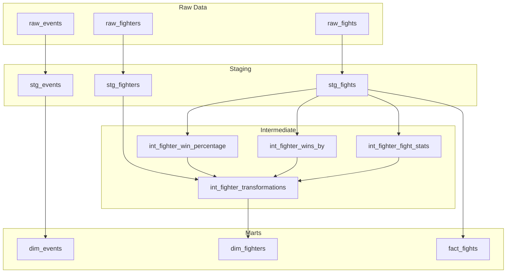

```mermaid
flowchart TD
    subgraph Raw Data
        raw_events
        raw_fights
        raw_fighters
    end

    subgraph Staging
        stg_events["stg_events"]
        stg_fights["stg_fights"]
        stg_fighters["stg_fighters"]
    end

    subgraph Intermediate
        int_fighter_win_percentage["int_fighter_win_percentage"]
        int_fighter_wins_by["int_fighter_wins_by"]
        int_fighter_fight_stats["int_fighter_fight_stats"]
        int_fighter_transformations["int_fighter_transformations"]
    end

    subgraph Marts
        dim_events["dim_events"]
        dim_fighters["dim_fighters"]
        fact_fights["fact_fights"]
    end

    %% Raw to Staging
    raw_events --> stg_events
    raw_fights --> stg_fights
    raw_fighters --> stg_fighters

    %% Staging to Intermediate
    stg_fights --> int_fighter_win_percentage
    stg_fights --> int_fighter_wins_by
    stg_fights --> int_fighter_fight_stats
    stg_fighters --> int_fighter_transformations
    int_fighter_win_percentage --> int_fighter_transformations
    int_fighter_wins_by --> int_fighter_transformations
    int_fighter_fight_stats --> int_fighter_transformations

    %% Intermediate to Marts
    stg_events --> dim_events
    int_fighter_transformations --> dim_fighters
    stg_fights --> fact_fights
```