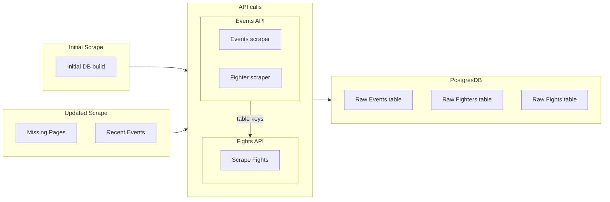

```mermaid
flowchart LR 
    subgraph build["Initial Scrape"]
        inital_db_build["Initial DB build"]
    end

    subgraph checks["Updated Scrape"]
        missing_pages["Missing Pages"]
        recent_events["Recent Events"]
    end

    subgraph api_calls["API calls"]
        subgraph events_api["Events API"]
            scrape_events["Events scraper"]    
            scrape_fighters["Fighter scraper"]
        end
        subgraph fights_api["Fights API"]
            scrape_fights["Scrape Fights"]
        end
    end

    subgraph storage["PostgresDB"]
        raw_events_table["Raw Events table"]
        raw_fighters_table["Raw Fighters table"]
        raw_fights_table["Raw Fights table"]
    end

    build --> api_calls 
    checks --> api_calls
    events_api -->|table keys| fights_api 
    api_calls --> storage

```
