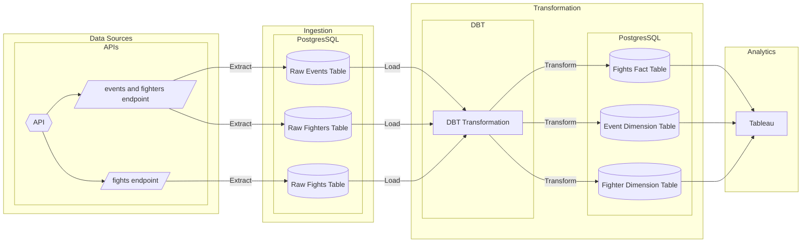

```mermaid
flowchart LR
    subgraph Data Sources 
      subgraph APIs
        API{{API}} --> Events[/events and fighters endpoint/]
        API --> Fights[/fights endpoint/]
      end
    end

    subgraph Ingestion
      subgraph PostgresSQL 
        Events -->|Extract| RawEvents[(Raw Events Table)]
        Fights -->|Extract| RawFights[(Raw Fights Table)]
        Events -->|Extract| RawFighters[(Raw Fighters Table)]
      end
    end

    subgraph Transformation
      subgraph DBT 
        RawEvents -->|Load| dbt[DBT Transformation]
        RawFights -->|Load| dbt
        RawFighters -->|Load| dbt
      end
      subgraph PostgresSQL
        dbt -->|Transform| Facts[(Fights Fact Table)]
        dbt -->|Transform| EventDimension[(Event Dimension Table)]
        dbt -->|Transform| FighterDimension[(Fighter Dimension Table)]
      end
    end

    subgraph Analytics
        Facts --> Reports[Tableau]
        FighterDimension --> Reports[Tableau]
        EventDimension --> Reports[Tableau]
    end
```